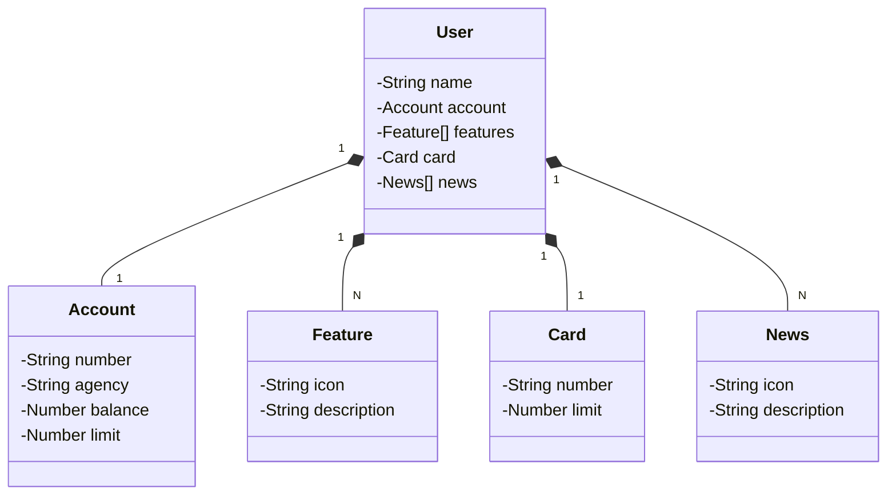

# Bank API - Java

A simple banking API built with Java and Spring Boot. This application provides features for managing users, accounts, cards, and news. The API was developed during the **Decola Tech Bootcamp** by Avanade.

---

## 🚀 Key Technologies

- Java 17
- Spring Boot 3
- Spring Data JPA
- OpenAPI (Swagger)

---

## 🧠 Domain Class Diagram

---

## 📂 API Endpoints

### 👤 User Endpoints

- `GET /users/{userId}`: Retrieve user details by ID.
- `POST /users`: Create a new user.
- `GET /users/{userId}/balance`: Retrieve the user's account balance.
- `GET /users/{userId}/news`: Retrieve news associated with the user.

### 💳 Card Endpoints

- `GET /cards/{cardId}/limit`: Retrieve the available limit for a card.

---

## 📝 Notes

This project was developed for learning purposes and showcases a basic structure for building a RESTful API using Java and Spring Boot.

